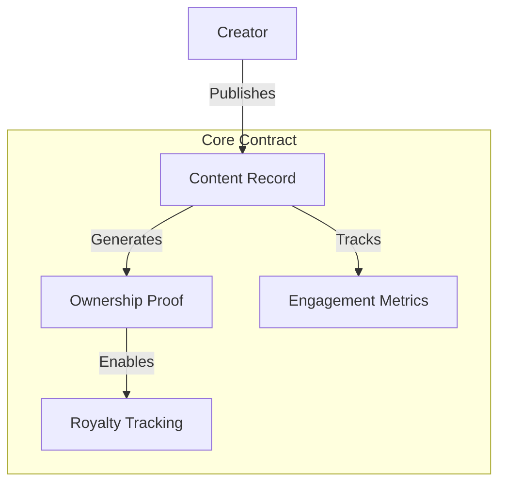

# 📚 PublishCrawler 🕸️

## Overview
PublishCrawler is a decentralized platform designed to revolutionize content publishing and engagement tracking using blockchain technology. By leveraging Stacks and Clarity smart contracts, we enable creators to record, verify, and monetize their published works with unprecedented transparency and trust.

## 🌟 Key Features
- Immutable Content Tracking
- Transparent Publication History
- Creator Verification Mechanisms
- Engagement and Royalty Tracking

## 💡 Problem Solved
Traditional content publishing platforms suffer from:
- Lack of transparent attribution
- Complex royalty distribution
- Limited creator control
- Opaque engagement metrics

PublishCrawler solves these challenges by providing a blockchain-native solution.

## 🛠 Technical Architecture
- **Smart Contract**: Manages publication records, ownership, and engagement tracking
- **Stacks Blockchain**: Provides secure, decentralized infrastructure
- **Clarity Language**: Ensures predictable, auditable contract execution



## 🚀 Quick Start

### Prerequisites
- Stacks Wallet
- Clarinet
- Basic understanding of blockchain concepts

### Installation
```bash
git clone https://github.com/your-org/publish-crawler
cd publish-crawler
clarinet check
```

## 📝 Usage Example
```clarity
;; Publish a new content piece
(publish-content 
  "My Revolutionary Article" 
  "https://example.com/content" 
  "A groundbreaking exploration of decentralized publishing"
)
```

## 🔍 Contract Functions

### Public Functions

#### publish-content
```clarity
(define-public (publish-content 
  (title (string-utf8 256)) 
  (url (string-utf8 512)) 
  (description (string-utf8 1024))
))
```
Publishes a new content piece with verifiable ownership.

#### track-engagement
```clarity
(define-public (track-engagement 
  (content-id uint) 
  (engagement-type uint)
))
```
Records and verifies content engagement metrics.

### Read-Only Functions

#### get-content-details
```clarity
(define-read-only (get-content-details (content-id uint))
```
Retrieves comprehensive details about a published content piece.

## 🔒 Security Considerations

### Limitations
- Content record size constrained by block limits
- Engagement tracking has predefined metric types
- Single creator per content piece

### Best Practices
- Verify content ownership before publishing
- Use unique, descriptive content identifiers
- Monitor and validate engagement metrics

## 💻 Development

### Testing
1. Install Clarinet
2. Run test suite:
```bash
clarinet test
```

### Local Development
```bash
clarinet console
```

## 🤝 Contributing
We welcome contributions! Please see `CONTRIBUTING.md`

## 📜 License
MIT License